# 🌟 Portfolyo CMS - The Ultimate Developer Portfolio & CMS

[](https://github.com/aiyu-ayaan/Portfolyo CMS)
[](https://opensource.org/licenses/MIT)
[](https://nextjs.org/)
[](https://reactjs.org/)
[](https://www.mongodb.com/)
[](https://www.docker.com/)
[](https://github.com/aiyu-ayaan/Portfolyo CMS/wiki)
[](https://github.com/aiyu-ayaan/Portfolyo CMS)
[](https://wakatime.com/badge/github/aiyu-ayaan/Portfolyo CMS)


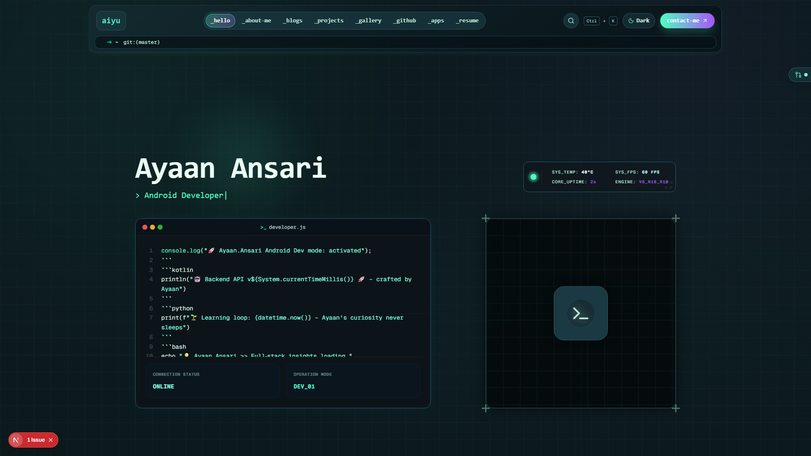

A modern, responsive, and **fully customizable** portfolio website and Content Management System built with **Next.js 16 (App Router)**, **React 19**, **Tailwind CSS 4**, and **MongoDB**. 

Featuring a gorgeous space-themed user interface, a highly advanced **Admin Panel**, an integrated **AI Neural Core (Gemini)**, and a visual **Task Scheduler**, `Portfolyo CMS` is designed for developers who want a production-ready, security-hardened portfolio with zero-hassle content management.

> [!TIP]
> **📚 Need full guides?** Explore the [Complete Documentation Wiki](https://github.com/aiyu-ayaan/Portfolyo CMS/wiki) or jump to the [Quick Start Guide](https://github.com/aiyu-ayaan/Portfolyo CMS/wiki/Quick-Start) to get running in 5 minutes!

---

## ✨ Features Spotlight

### 🧠 AI Neural Core (Gemini Integration)
Synthesize content, titles, and layouts directly from your admin panel:
- **AI Theme Architect**: Generate a beautiful, balanced 64+ token custom design system (light & dark modes) from a single concept prompt.
- **Creative Project Synthesis**: Generate catchy project names, write optimized professional summaries, and auto-map tech stacks.
- **Dynamic Subtitle Builder**: Contextually generates engaging subtitles for your projects, blogs, and gallery.

### ⏰ Task Scheduler & Cron Jobs
Full control over background tasks with a custom 60s ticking engine:
- **Visual Builder & Parser**: Select intervals via UI; a real-time translator converts expressions (e.g. `*/15 * * * *`) into human-readable text.
- **Automated Maintenance**: Auto-purge orphaned uploads and optimize heavy PNG/JPG files to highly compressed WebP.
- **Custom Webhook Tasks**: Register API endpoints to execute on schedule, with custom methods, body payloads, and custom headers supporting n8n-style **Fixed/Expression switch toggles**.
- **Global Encrypted Secrets**: Save secure environment variables (`$env.KEY`) globally using secure AES-256 encryption, safely masked (`[SECRET: KEY]`) inside dynamic evaluation previews.
- **Predefined System Variables**: Evaluate context-aware variables dynamically, including `$site` for dynamic site URL mapping and `$device` for host OS/CPU platform specs (e.g., `$device.platform`, `$device.os`).

### 📧 Webhook & Push Dual-Routing
Advanced contact settings for real-time lead routing:
- **Dual Routing**: Forward contact form entries to **n8n Webhook endpoints** and push applications simultaneously.
- **Unified Push Notifications**: Seamlessly routes notifications to **Discord Webhooks**, **Telegram Bots**, or **ntfy Topics** with bearer token support.
- **Route Validation**: Instant one-click connection tests to verify endpoint accessibility.

### 🎨 Live Theme Customizer
- **21 Preset Themes**: Switch between Dracula, Tokyo Night, Nord, Cyberpunk, Catppuccin, and more with a single click.
- **Granular Palette Tuning**: Modify primary, secondary, background, text, and border tokens with immediate live preview.

### 📝 Automated Blog & Masonry Gallery
- **Blog System**: Markdown-based editor with syntax highlighting, auto-saving drafts, and Notion sync API support.
- **Gallery**: Masonry grid layout with auto image optimization and HEIC photo upload compatibility.

---

## 📸 Visual Showcase

| Module | Desktop Dark Mode (1920x1080) | Mobile Dark Mode (430x932) |
|---|---|---|
| **Landing Page** | [](public/screenshots/desktop-dark-home.png) | [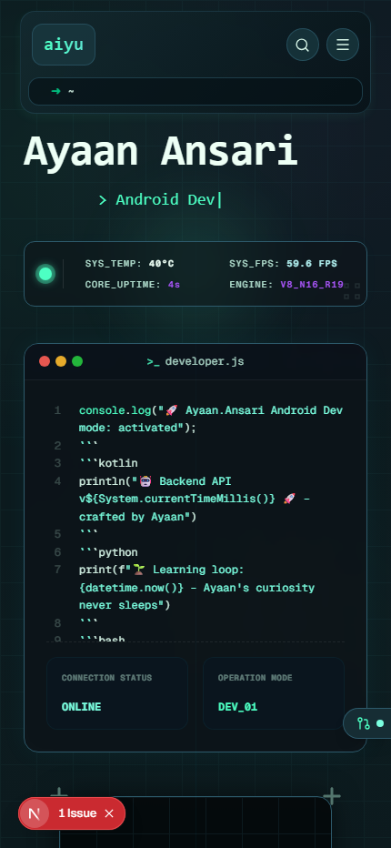](public/screenshots/mobile-dark-home.png) |
| **About Biography** | [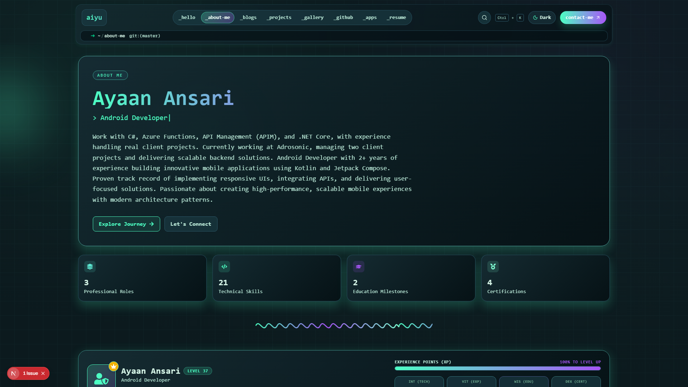](public/screenshots/desktop-dark-about.png) | [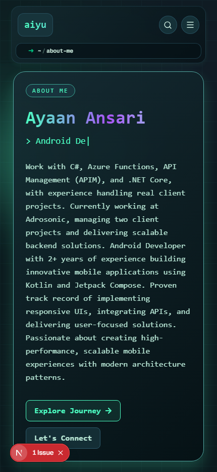](public/screenshots/mobile-dark-about.png) |
| **Projects Showcase** | [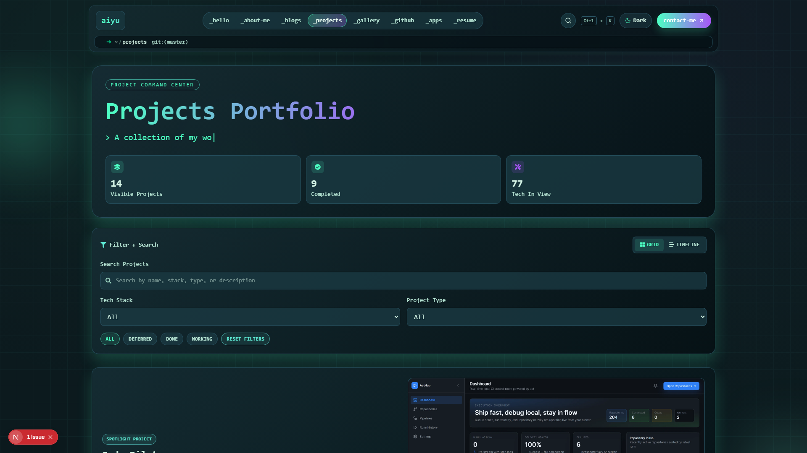](public/screenshots/desktop-dark-projects.png) | [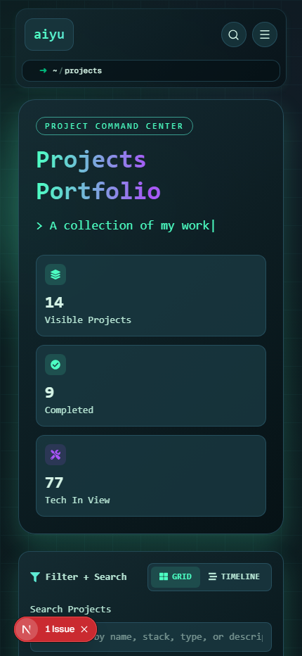](public/screenshots/mobile-dark-projects.png) |
| **Blogs & Articles** | [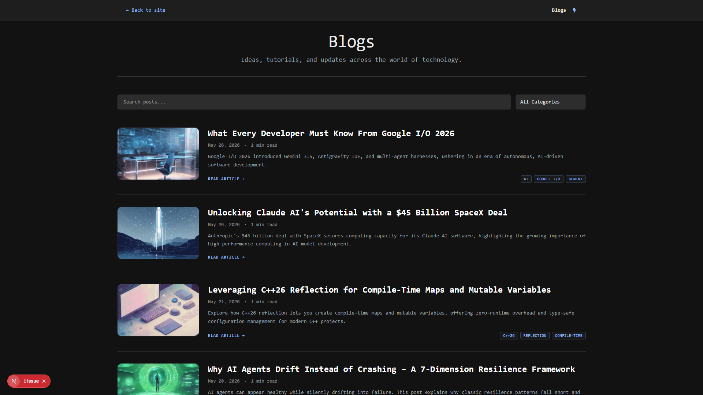](public/screenshots/desktop-dark-blogs.png) | [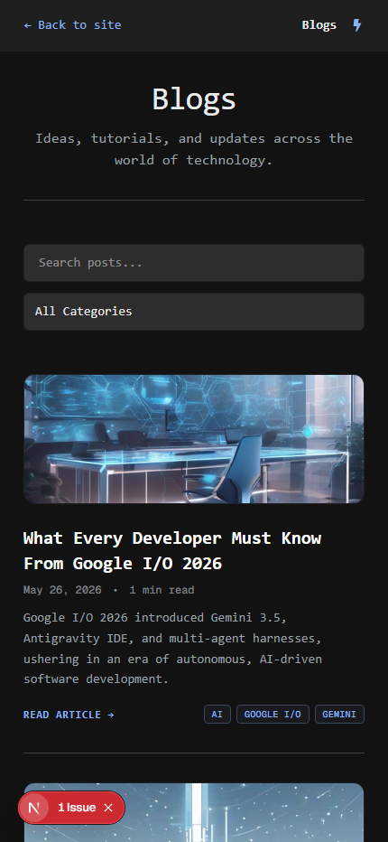](public/screenshots/mobile-dark-blogs.png) |
| **Interactive Gallery** | [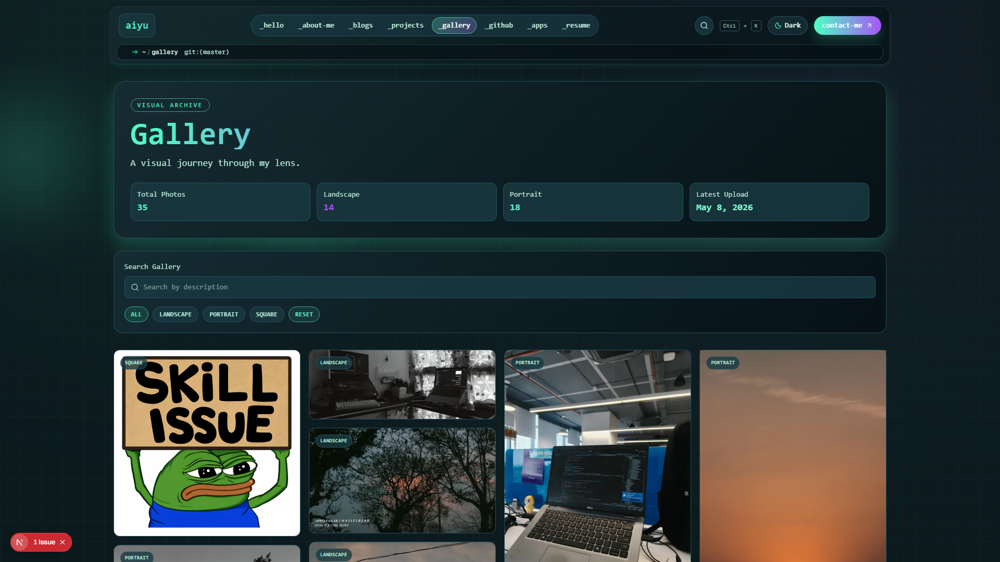](public/screenshots/desktop-dark-gallery.png) | [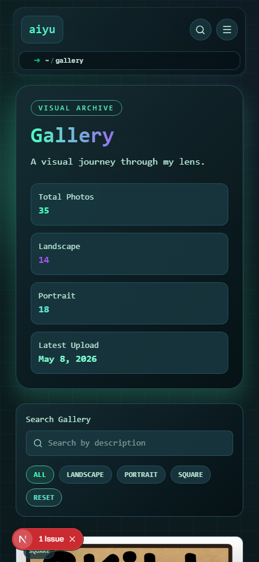](public/screenshots/mobile-dark-gallery.png) |
| **Contact Dashboard** | [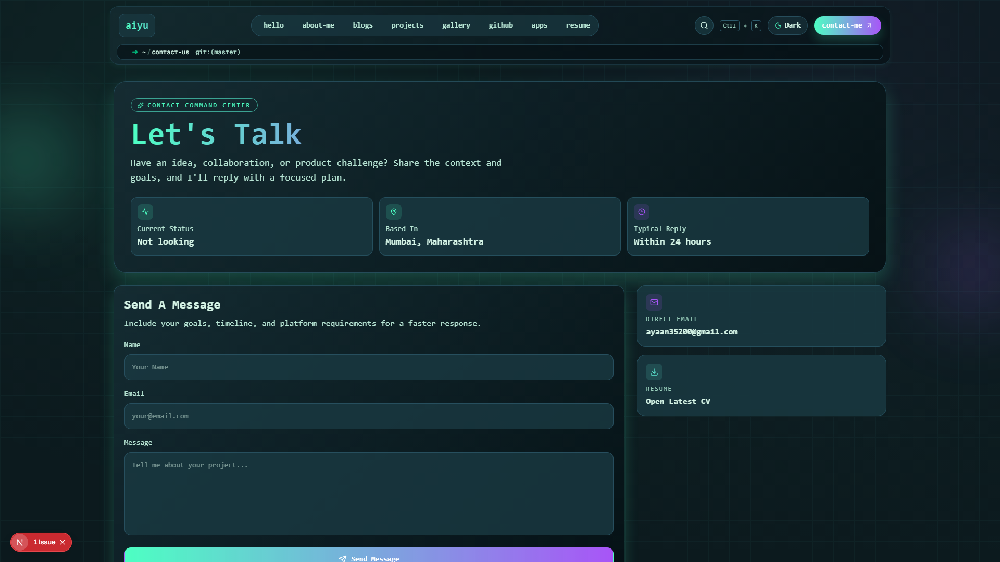](public/screenshots/desktop-dark-contact.png) | [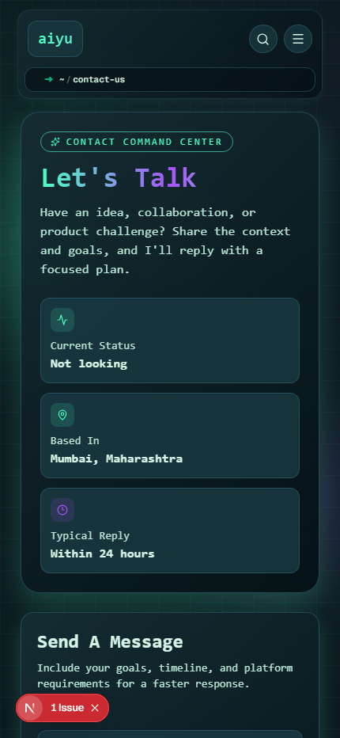](public/screenshots/mobile-dark-contact.png) |
| **Admin Command Center** | [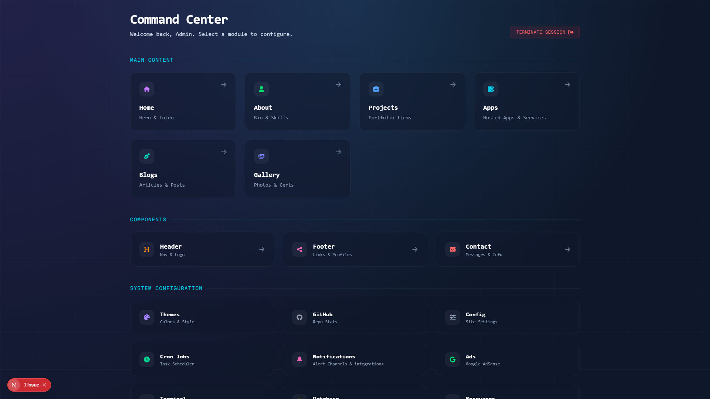](public/screenshots/admin.png) | *Desktop Only* |

---

## 🚀 Quick Start (Docker Deployment)

The fastest, most secure way to deploy `Portfolyo CMS` is using Docker.

### 1. Clone & Configure
```bash
git clone https://github.com/aiyu-ayaan/Portfolyo CMS.git
cd Portfolyo CMS
cp .env.example .env
```

### 2. Generate Secure Credentials
Run these node commands to generate secure keys for your `.env` file:
```bash
# JWT Secret Key
node -e "console.log('JWT_SECRET=' + require('crypto').randomBytes(64).toString('hex'))"
# MongoDB Key
node -e "console.log('MONGO_REPLICA_SET_KEY=' + require('crypto').randomBytes(48).toString('hex'))"
```

### 3. Build & Deploy
Start all services (App + 3-Node MongoDB Replica Set + Nginx Proxy):
```bash
npm run docker:build
npm run docker:up
```

### 4. Verify Security Hardening
Check if non-root user settings, read-only root system, and miner-prevention capabilities are active:
```bash
npm run docker:verify
```

### 5. Access and Seed
Visit the link or run a curl request to populate your fresh database:
```bash
curl http://localhost/api/seed
```
- **Portfolio**: [http://localhost](http://localhost)
- **Admin Panel**: [http://localhost/admin](http://localhost/admin)

---

## 🛠️ The Tech Stack

- **Core**: Next.js 16 (App Router), React 19, Tailwind CSS 4, Framer Motion
- **Database**: MongoDB with Mongoose ODM
- **Image Processing**: Sharp (with HEIC support)
- **Authentication**: JWT (`jose`), bcrypt hashing
- **Security Protocols**: Non-root execution, Capability dropping, `noexec /tmp` directory, rate limiting, and secure headers.
- **Testing & Tooling**: Playwright, ESLint

---

## 📖 Deep-Dive Documentation Wiki

- ⚡ **[Quick Start](https://github.com/aiyu-ayaan/Portfolyo CMS/wiki/Quick-Start)** - Get running in 5 minutes.
- 🔧 **[Admin Manual](https://github.com/aiyu-ayaan/Portfolyo CMS/wiki/Admin-Panel-Manual)** - Complete dashboard usage guide with images.
- 🐳 **[Deployment Guide](https://github.com/aiyu-ayaan/Portfolyo CMS/wiki/Deployment-Guide)** - Scale out to cloud instances and VPS.
- 🔒 **[Security Hardening](https://github.com/aiyu-ayaan/Portfolyo CMS/wiki/Security-Guide)** - Enterprise safety best practices.
- 📊 **[API Specification](https://github.com/aiyu-ayaan/Portfolyo CMS/wiki/API-Documentation)** - Full REST endpoints usage reference.

---

**Licensed under [MIT](LICENSE)** • Maintained by [Portfolyo CMS Ayaan](https://github.com/aiyu-ayaan) and the Open-Source Community.
